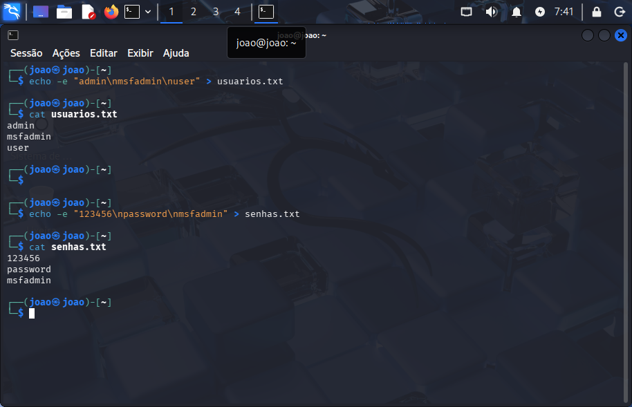
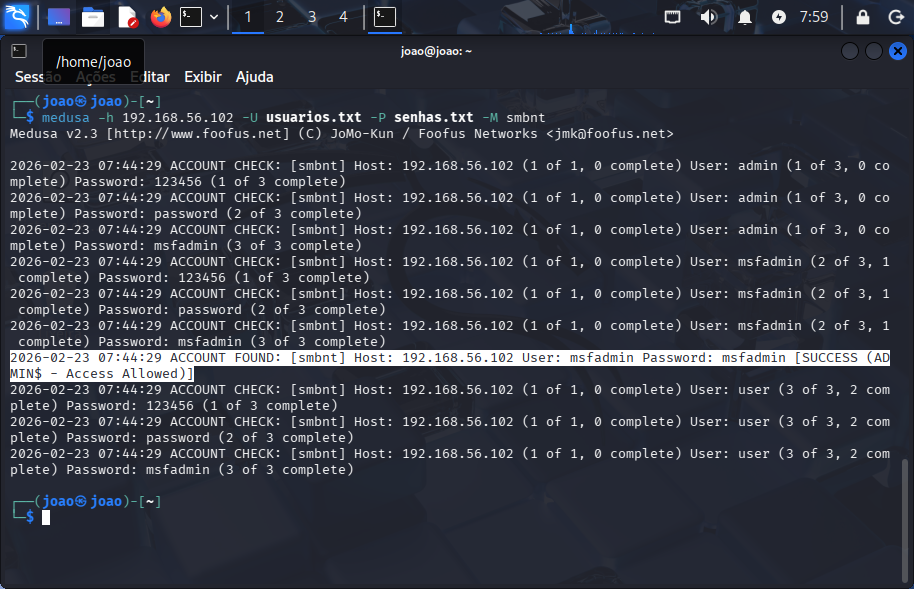
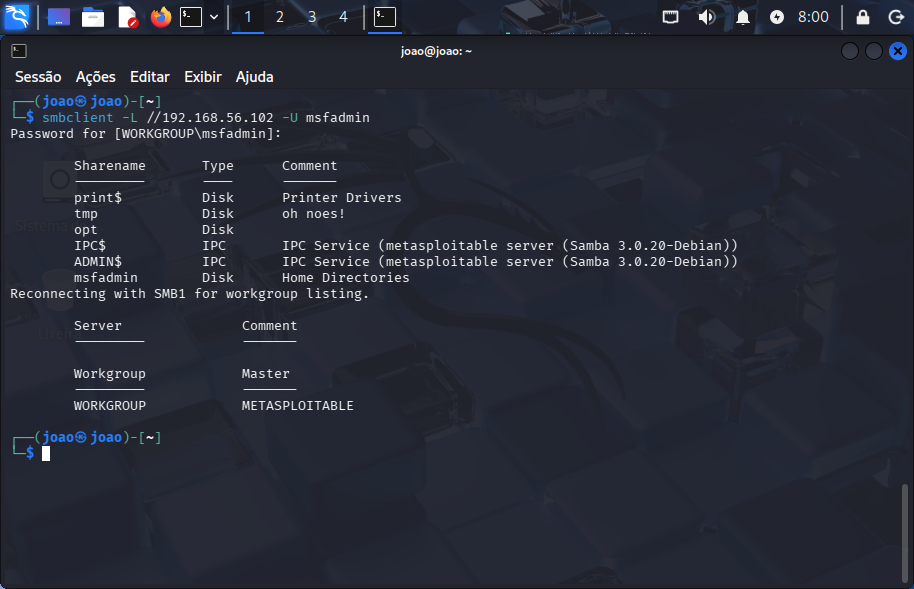
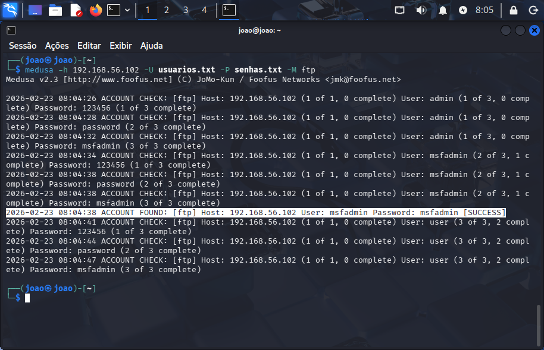
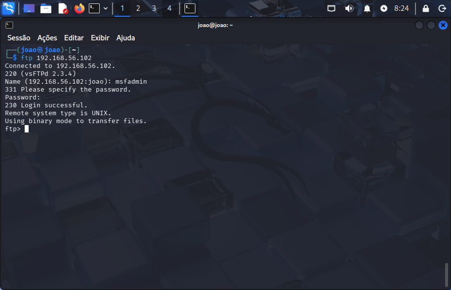

# Projeto-Ethical-Hacking
Brute Force com Medusa e Kali Linux

# 🛡️ Projeto Ethical Hacking: Brute Force Multi-Protocolo com Medusa

Este projeto foi desenvolvido como parte do desafio prático da **DIO (Digital Innovation One)**. O objetivo é demonstrar a execução de ataques de força bruta em um ambiente controlado, utilizando o **Kali Linux** para comprometer serviços de rede no **Metasploitable 2**.

## 🛠️ Ferramentas e Ambiente
* **Sistema Atacante:** Kali Linux (VM)
* **Alvo:** Metasploitable 2 (VM)
* **Ferramenta:** Medusa v2.2
* **Rede:** Host-Only (Isolada)

## 📂 Estrutura do Repositório
* [/wordlists](./wordlists): Dicionários de usuários e senhas utilizados.
* [/imagens](./imagens): Capturas de tela das evidências dos testes.

---

## 🚀 Passo a Passo da Execução

### 1. Preparação das Wordlists
Iniciei o laboratório criando listas de usuários e senhas contendo credenciais comuns e as senhas padrão do sistema alvo.

---

### 2. Ataque ao Serviço SMB (Portas 139/445)
Utilizei o módulo `smbnt` do Medusa para realizar o brute force contra o serviço de compartilhamento de arquivos.
- **Comando:** `medusa -h 192.168.56.102 -U wordlists/usuarios.txt -P wordlists/senhas.txt -M smbnt`

**Resultado (Senha Encontrada):**

**Validação do Acesso:**
Após encontrar a senha, validei o acesso listando os compartilhamentos do servidor.
- **Comando:** `smbclient -L //192.168.56.102/ -U msfadmin`
  

---

### 3. Ataque ao Serviço FTP (Porta 21)
O mesmo processo foi aplicado ao protocolo FTP para demonstrar a vulnerabilidade em múltiplos serviços.
- **Comando:** `medusa -h 192.168.56.102 -U wordlists/usuarios.txt -P wordlists/senhas.txt -M ftp`

**Resultado (Senha Encontrada):**

**Validação do Acesso:**
Login realizado com sucesso no servidor de arquivos via terminal.
- **Comando:** `ftp 192.168.56.102`

---

## 🛡️ Conclusões e Medidas de Defesa
A execução deste laboratório permitiu compreender como senhas fracas e protocolos mal configurados facilitam a intrusão. Para mitigar esses riscos, recomenda-se:

1.  **Políticas de Senhas:** Exigir senhas complexas e trocas periódicas.
2.  **Bloqueio de Conta (Lockout):** Configurar o sistema para travar contas após tentativas falhas consecutivas.
3.  **Desativação de Protocolos Legados:** Desabilitar serviços desnecessários ou versões antigas de protocolos (como SMBv1).
4.  **Uso de MFA:** Implementar Autenticação de Dois Fatores sempre que possível.

---
**Desenvolvido por João Paulo da Silva Pinheiro** *Estudante de Segurança da Informação na DIO.*
